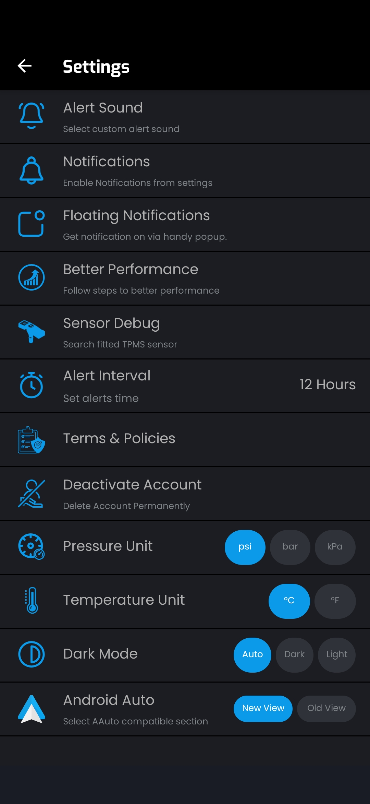

# JK Tyre TREEL TPMS — ESP32 Receiver, Decoder & Web Dashboard

[](LICENSE)
[](https://www.espressif.com/)
[](docs/PROTOCOL_SPECIFICATION.md)

Open-source **Bluetooth Low Energy (BLE)** receiver, decoder, responsive Web Dashboard, and REST API for **JK Tyre TREEL / SmartTyre TPMS Sensors** using **ESP32** microcontrollers or **Windows PC**.

---

## 🌟 Key Features

- **Dual Telemetry Decoding**:
  - **Mode 1: Apple iBeacon Mode** (`...FFE0` UUID) — Extracts Pressure (PSI) & Temperature (°C).
  - **Mode 2: Encrypted GATT Mode** (AES-128-ECB via `mbedTLS`) — Decrypts full payload with secret key for Pressure, Temperature, and Battery %.
- **Dual-Endian MAC Matching**: Correctly resolves both Forward MAC (`D2:58:6D:8F:16:10`), Reversed MAC (`10:16:8F:6D:58:D2`), and 6-character Short Sensor IDs (`8F1610`).
- **High Performance Continuous Scanning**: Powered by `NimBLE-Arduino` for 100% packet capture with zero buffer drops.
- **Embedded Web Server & Live Dashboard**:
  - Responsive 4-quadrant vehicle chassis UI (FL, FR, RL, RR) with AJAX 1Hz live polling.
  - Displays Pressure (PSI, Bar, kPa), Temperature (°C, °F), Battery %, RSSI, and Last Seen timer.
  - Live rolling BLE packet log terminal right in the browser.
- **REST JSON API**:
  - `GET /api/data`: Returns JSON telemetry state for all 4 tires, free heap, uptime, and packet counters.
  - `GET /api/logs`: Returns recent system logs.
  - `GET /api/clear`: Clears rolling log buffer.
- **Dual Wi-Fi Modes**: Tries connecting to your Wi-Fi router (STA mode) first; automatically falls back to Access Point mode (`ESP32_TPMS_Dashboard` / `12345678`).
- **Optional OLED Display**: Supports 1.3" SH1106 and 0.96" SSD1306 I2C OLED screens with a 4-quadrant layout.
- **Headless Mode**: Can run completely headless as a discreet wireless BLE $\rightarrow$ Wi-Fi gateway inside your vehicle.
- **Windows Desktop CLI & Diagnostic Tools**: Included Python CLI sniffer tool for Windows PC.

---

## 📐 Project Architecture

```
                       ┌────────────────────────┐
                       │  JK Tyre TREEL TPMS    │
                       │     BLE Sensors        │
                       └───────────┬────────────┘
                                   │ BLE Advertisements (iBeacon / AES GATT)
                                   ▼
                       ┌────────────────────────┐
                       │      ESP32 Board       │
                       │ (DevKit / C3 SuperMini)│
                       └─────┬────────────┬─────┘
                             │            │
             Wi-Fi (AP/STA)  │            │  I2C (Optional)
                             ▼            ▼
                     ┌───────────────┐ ┌──────────────┐
                     │ Web Dashboard │ │ OLED Display │
                     │  & REST API   │ │ (1.3"/0.96") │
                     └───────────────┘ └──────────────┘
```

---

## 📁 Repository Structure

```
├── README.md                          # Main Project Overview & Quick Start Guide
├── LICENSE                            # Open-source MIT License
├── .gitignore                         # Git exclusion rules
├── docs/                              # Detailed Documentation & Guides
│   ├── PROTOCOL_SPECIFICATION.md      # Deep-dive BLE protocol & AES telemetry specification
│   ├── ESP32_C3_SUPERMINI_GUIDE.md    # Dedicated setup & pinout guide for ESP32-C3 SuperMini
│   └── WINDOWS_CLI_GUIDE.md           # Step-by-step setup for Windows Python CLI tool
├── lib/                               # Reusable C++ Libraries
│   └── TreelTPMS/                     # Standalone C++ Treel TPMS BLE Library
│       ├── TreelTPMS.h                # Header-only/exportable library API
│       ├── TreelTPMS.cpp              # AES-128 & iBeacon decoder implementation
│       └── examples/
│           └── BasicScanner/          # Standalone minimal 30-line Arduino example
├── src/                               # ESP32 Modular Applications
│   ├── esp32_tpms_webserver/          # Tested Modular Firmware for Standard ESP32 (30/38 Pin)
│   │   ├── Config.h                   # Pins, Wi-Fi credentials & sensor whitelist
│   │   ├── Logger.h / Logger.cpp      # Thread-safe event logging ring buffer
│   │   ├── TreelTPMS.h / .cpp         # Core BLE receiver engine
│   │   ├── DisplayManager.h / .cpp    # I2C OLED display renderer
│   │   ├── WebServerManager.h / .cpp  # Web dashboard & REST API
│   │   └── esp32_tpms_webserver.ino   # Clean ~45-line entry point sketch
│   └── esp32_c3_tpms_webserver/       # Tested Modular Firmware for ESP32-C3 SuperMini
│       ├── Config.h                   # Pinout & fast timeout configuration
│       ├── Logger.h / Logger.cpp      # Zero-heap log buffer
│       ├── TreelTPMS.h / .cpp         # RISC-V zero-allocation scanner
│       ├── DisplayManager.h / .cpp    # Display driver
│       ├── WebServerManager.h / .cpp  # Web dashboard & REST API
│       └── esp32_c3_tpms_webserver.ino# Clean entry point sketch
└── tools/                             # Desktop Tools
    └── python_tpms_app/               # Windows Python BLE Sniffer & Diagnostics
        ├── core/                      # Decoder & Scanner modules
        ├── tpms_cli.py                # Command-Line live sniffer tool
        ├── diagnose_ble.py            # Hardware BLE diagnostic utility
        └── requirements.txt           # Python dependencies
```

---

## ⚡ Quick Start Guide (ESP32 Firmware)

### 1. Required Arduino IDE Libraries

1. Open **Arduino IDE**.
2. Go to **Tools -> Manage Libraries...**
3. Search for and install:
   - **`NimBLE-Arduino`** (by *h2zero*) — Required for BLE scanning.
   - **`U8g2`** (by *Oliver Kraus*) — Required only if using OLED display (`ENABLE_OLED true`).

### 2. Select Tested Firmware & Configure Settings

Choose the tested sketch corresponding to your hardware:
- **Standard ESP32 (30/38-Pin DevKit)**: Open [`src/esp32_tpms_webserver/esp32_tpms_webserver.ino`](src/esp32_tpms_webserver/esp32_tpms_webserver.ino)
- **ESP32-C3 SuperMini**: Open [`src/esp32_c3_tpms_webserver/esp32_c3_tpms_webserver.ino`](src/esp32_c3_tpms_webserver/esp32_c3_tpms_webserver.ino)

> [!IMPORTANT]
> **Arduino IDE Partition Setting (Required for ESP32-C3 SuperMini)**:
> When compiling for **ESP32-C3 SuperMini**, the default partition scheme reserves only 1.25 MB for program storage, which can trigger a `text section exceeds available space` compilation error.
> 
> **How to configure in Arduino IDE**:
> 1. Go to **Tools $\rightarrow$ Partition Scheme**
> 2. Change from *Default 4MB with spiffs* to either:
>    - **`Huge APP (3MB No OTA/1MB SPIFFS)`** *(Recommended)*
>    - **`Minimal SPIFFS (1.9MB APP with OTA)`**
>
> This expands program flash storage from 1.25 MB to **1.9 MB – 3.0 MB**.

---

## ⚙️ Central Configuration Guide (`Config.h`)

All user settings, units, alert thresholds, hardware pins, and network parameters are centralized in `Config.h` in each firmware directory (`src/esp32_tpms_webserver/Config.h` and `src/esp32_c3_tpms_webserver/Config.h`).

| Configuration Option | Default Value | Description |
| :--- | :--- | :--- |
| **`ENABLE_WEBSERVER`** | `true` | Set to `false` to disable Wi-Fi and Web Server (pure ultra-low-power BLE mode) |
| **`ENABLE_OLED`** | `true` | Set to `false` if running headless without an I2C OLED screen |
| **`ENABLE_DEMO_MODE`** | `false` | Set to `true` to test OLED & Web Dashboard with simulated dummy values & warnings |
| **`DISPLAY_PRESSURE_UNIT`** | `UNIT_PSI` | Select OLED pressure unit: `UNIT_PSI` (PSI), `UNIT_BAR` (Bar), or `UNIT_KPA` (kPa) |
| **`DISPLAY_TEMP_UNIT`** | `UNIT_CELSIUS` | Select OLED temperature unit: `UNIT_CELSIUS` (°C) or `UNIT_FAHRENHEIT` (°F) |
| **`ALERT_MIN_PSI`** | `26.0f` | Low pressure warning threshold (PSI) |
| **`ALERT_MAX_PSI`** | `45.0f` | High pressure warning threshold (PSI) |
| **`ALERT_MAX_TEMP_C`** | `70.0f` | High temperature warning threshold (°C) |
| **`ALERT_MIN_BATT`** | `15` | Low battery percentage warning threshold (%) |
| **`WIFI_SSID` / `WIFI_PASS`** | `"Your_WiFi_SSID"` | Your home or vehicle Wi-Fi router credentials |
| **`AP_SSID` / `AP_PASS`** | `"ESP32_TPMS_..."` | SoftAP fallback SSID and Password |
| **`SENSOR_MACS`** | `{"D2:58...", ...}` | Whitelist of your 4 TPMS sensor MAC addresses |

---

## 🔍 How to Find & Configure Your TPMS Sensor MAC Addresses

> [!IMPORTANT]
> The MAC addresses included in the source code are sample MAC addresses. **You MUST update them with your own 4 TPMS sensor MAC addresses** for the receiver to match and display readings for your specific tires.

### Step 1: Finding Your Sensor MAC Addresses

You can find your sensor MAC addresses using either of these two methods:

#### Method A: Official JK Tyre SmartTyre App (Recommended)
1. Open the official **JK Tyre SMART TYRE** app on your phone.
2. Go to **Settings** $\rightarrow$ **Sensor Debug** ("Search fitted TPMS sensor").
3. Note down the MAC address / Short ID (last 6 hex characters) listed for each of your 4 tires (FL, FR, RL, RR).

<p align="center">
  
</p>

#### Method B: PC Diagnostic Tool
Run the included Python diagnostic script on your Windows PC:
```cmd
cd tools/python_tpms_app
python diagnose_ble.py
```
The script will scan for nearby TREEL TPMS sensors and output their detected MAC addresses and Short IDs automatically.

---

### Step 2: Updating MAC Addresses in Project Files

#### 1. In ESP32 Firmware (`src/esp32_tpms_webserver/esp32_tpms_webserver.ino`):
Open [`src/esp32_tpms_webserver/esp32_tpms_webserver.ino`](src/esp32_tpms_webserver/esp32_tpms_webserver.ino) and replace the values in `SENSOR_MACS` and `SENSOR_SHORT_IDS`:

```cpp
// --- 4 Whitelisted TPMS Sensors ---
const char* SENSOR_MACS[4] = {
    "YOUR_FL_MAC",  // FL: Front Left
    "YOUR_FR_MAC",  // FR: Front Right
    "YOUR_RL_MAC",  // RL: Rear Left
    "YOUR_RR_MAC"   // RR: Rear Right
};

const char* SENSOR_SHORT_IDS[4] = {
    "FL_ID",  // FL Short ID (Last 6 hex digits of MAC)
    "FR_ID",  // FR Short ID
    "RL_ID",  // RL Short ID
    "RR_ID"   // RR Short ID
};
```

#### 2. In Windows Python CLI Tool (`tools/python_tpms_app/core/scanner.py`):
Open [`tools/python_tpms_app/core/scanner.py`](tools/python_tpms_app/core/scanner.py) and update `WHITELISTED_SENSORS`:

```python
WHITELISTED_SENSORS: Dict[str, Dict[str, str]] = {
    "YOUR_FL_MAC": {"pos": "FL", "name": "Front Left", "short_id": "FL_ID"},
    "YOUR_FR_MAC": {"pos": "FR", "name": "Front Right", "short_id": "FR_ID"},
    "YOUR_RL_MAC": {"pos": "RL", "name": "Rear Left", "short_id": "RL_ID"},
    "YOUR_RR_MAC": {"pos": "RR", "name": "Rear Right", "short_id": "RR_ID"},
}
```
```

### 3. Flash to ESP32

1. Connect your ESP32 board via USB.
2. Select your Board under **Tools -> Board** (e.g. `ESP32 Dev Module` or `ESP32C3 Dev Module`).
3. Click **Upload**.

### 4. Access Live Web Dashboard

1. Open **Serial Monitor** at **115200 baud** to view boot logs and IP address.
2. Open a web browser on your phone, tablet, or PC:
   - **Connected to Wi-Fi**: Go to `http://<ESP32_IP>` (e.g. `http://192.168.1.100`).
   - **Access Point Fallback Mode**: Connect your phone Wi-Fi to `ESP32_TPMS_Dashboard` (password: `12345678`), then navigate to `http://192.168.4.1`.

---

## 🔌 Hardware Wiring Tables

### Standard ESP32 (38-Pin / 30-Pin DevKit) with OLED Display

All 4 OLED wires connect directly to the **LEFT HEADER** of the 38-pin board:

| OLED Display Pin | ESP32 Board Label | Location on Board |
| :--- | :--- | :--- |
| **VCC** | **3.3V** | Top-Left Pin (Pin 1) |
| **SCL** | **GPIO 27** | Left Header (Pin 11) |
| **SDA** | **GPIO 14** | Left Header (Pin 12) |
| **GND** | **GND** | Left Header (Pin 14) |

*For ESP32-C3 SuperMini wiring, see [ESP32-C3 SuperMini Setup Guide](docs/ESP32_C3_SUPERMINI_GUIDE.md).*

---

## 💻 Windows PC CLI Tool

If you prefer running a live BLE sniffer directly on a Windows laptop or PC without an ESP32 board, check out our easy-to-use Python CLI tool under [`tools/python_tpms_app/`](tools/python_tpms_app/).

For installation instructions, see the [Windows CLI Setup Guide](docs/WINDOWS_CLI_GUIDE.md).

```cmd
cd tools/python_tpms_app
pip install -r requirements.txt
python tpms_cli.py
```

---

## 🌐 Detailed Documentation Links

- 📖 [TREEL BLE Protocol & AES Specification](docs/PROTOCOL_SPECIFICATION.md)
- 🚀 [ESP32-C3 SuperMini Hardware Setup & Pinout Guide](docs/ESP32_C3_SUPERMINI_GUIDE.md)
- 🖥️ [Windows Desktop Python CLI Tool Setup Guide](docs/WINDOWS_CLI_GUIDE.md)

---

## ⚖️ License & Disclaimer

This project is licensed under the **MIT License** — see the [LICENSE](LICENSE) file for details.

*Disclaimer: This project is an open-source software implementation created for interoperability, educational, and DIY automotive enthusiast purposes. TREEL and JK Tyre are trademarks of their respective owners.*
