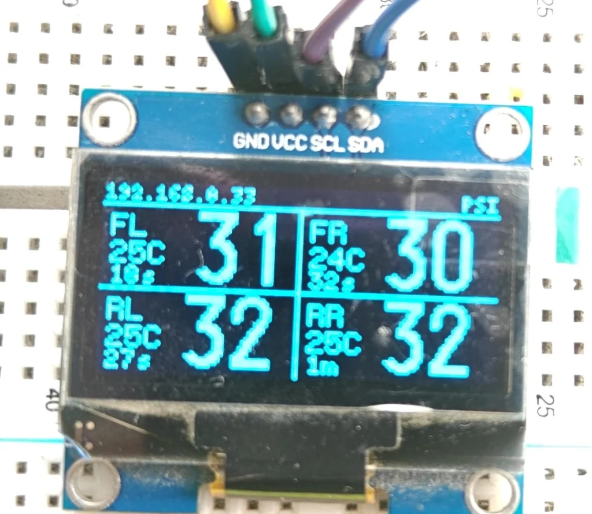
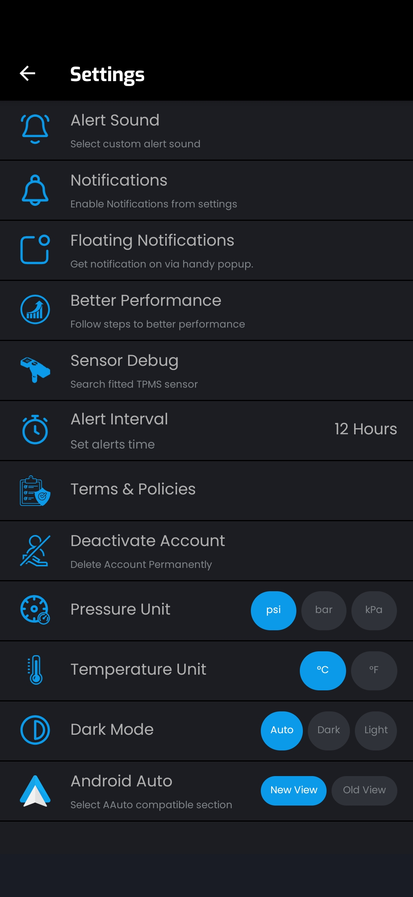

# JK Tyre TREEL TPMS — ESP32 Receiver, Decoder & Web Dashboard

[](LICENSE)
[](https://www.espressif.com/)
[](docs/PROTOCOL_SPECIFICATION.md)

Open-source **Bluetooth Low Energy (BLE)** receiver, decoder, responsive Web Dashboard, and REST API for **JK Tyre TREEL / SmartTyre TPMS Sensors** using **ESP32** microcontrollers.

---

## 🌟 Key Features

- **Dual Telemetry Decoding**:
  - **Mode 1: Apple iBeacon Mode** (`...FFE0` UUID) — Extracts Pressure (PSI) & Temperature (°C).
  - **Mode 2: Encrypted GATT Mode** (AES-128-ECB via `mbedTLS`) — Decrypts full payload with secret key for Pressure, Temperature, and Battery %.
- **Dual-Endian MAC Matching**: Correctly resolves both Forward MAC (`D2:58:6D:8F:16:10`), Reversed MAC (`10:16:8F:6D:58:D2`), and 6-character Short Sensor IDs (`8F1610`).
- **High Performance Continuous Scanning**: Powered by `NimBLE-Arduino` for 100% packet capture with zero buffer drops.
- **Embedded Web Server & Live Dashboard**:
  - Responsive 4-quadrant vehicle chassis UI (FL, FR, RL, RR) with AJAX 1Hz live polling.
  - Displays Pressure (PSI, Bar, kPa), Temperature (°C, °F), Battery %, RSSI, and Last Seen timer.
  - Live rolling BLE packet log terminal right in the browser.
- **REST JSON API**:
  - `GET /api/data`: Returns JSON telemetry state for all 4 tires, free heap, uptime, and packet counters.
  - `GET /api/logs`: Returns recent system logs.
  - `GET /api/clear`: Clears rolling log buffer.
- **Dual Wi-Fi Modes**: Tries connecting to your Wi-Fi router (STA mode) first; automatically falls back to Access Point mode (`ESP32_TPMS_Dashboard` / `12345678`).
- **Modular Multi-Display Support (Zero Memory Overhead)**:
  - **2.0" ST7789 SPI TFT Color Display** (GMT020-02 320x240 Landscape) — High resolution 4-quadrant modern automotive layout with FreeSans vector typography, battery %, and double-buffered age timers.
  - **1.3" SH1106 & 0.96" SSD1306 I2C OLED Displays** (128x64 resolution).
  - **Conditional Compilation**: Preprocessor macros (`DISPLAY_TYPE`) ensure only the selected display driver & font tables are compiled, keeping binary footprint minimal.
- **Headless Mode**: Can run completely headless (`DISPLAY_TYPE_NONE`) as a discreet wireless BLE $\rightarrow$ Wi-Fi gateway with zero display overhead.

<p align="center">
  
  <br>
  <em>1.3" I2C OLED Display showing live TPMS tire pressures (FL: 31 PSI, FR: 30 PSI, RL: 32 PSI, RR: 32 PSI) and web server IP address.</em>
</p>

---

## 📐 Project Architecture

```
                       ┌────────────────────────┐
                       │  JK Tyre TREEL TPMS    │
                       │     BLE Sensors        │
                       └───────────┬────────────┘
                                   │ BLE Advertisements (iBeacon / AES GATT)
                                   ▼
                       ┌────────────────────────┐
                       │      ESP32 Board       │
                       │ (DevKit / C3 SuperMini)│
                       └─────┬────────────┬─────┘
                             │            │
             Wi-Fi (AP/STA)  │            │  SPI / I2C (Modular)
                             ▼            ▼
                     ┌───────────────┐ ┌───────────────────────┐
                     │ Web Dashboard │ │ OLED (1.3"/0.96" I2C) │
                     │  & REST API   │ │ TFT (2.0" ST7789 SPI) │
                     └───────────────┘ └───────────────────────┘
```

---

## 📁 Repository Structure

```
├── README.md                          # Main Project Overview & Quick Start Guide
├── LICENSE                            # Open-source MIT License
├── .gitignore                         # Git exclusion rules
├── docs/                              # Detailed Documentation & Guides
│   ├── PROTOCOL_SPECIFICATION.md      # Deep-dive BLE protocol & AES telemetry specification
│   └── ESP32_C3_SUPERMINI_GUIDE.md    # Dedicated setup & pinout guide for ESP32-C3 SuperMini
├── lib/                               # Reusable C++ Libraries
│   └── TreelTPMS/                     # Standalone C++ Treel TPMS BLE Library
│       ├── TreelTPMS.h                # Zero-allocation high performance BLE receiver API
│       ├── TreelTPMS.cpp              # AES-128 & iBeacon decoder implementation
│       └── examples/
│           └── BasicScanner/          # Standalone minimal Arduino example
└── src/                               # ESP32 Modular Application
    └── esp32_tpms_webserver/          # Unified Firmware (Supports Standard ESP32 & ESP32-C3)
        ├── Config.h                   # Pins (auto-detects ESP32 vs C3), Wi-Fi & sensor whitelist
        ├── ConfigManager.h / .cpp     # NVS Flash persistent settings manager
        ├── Logger.h / Logger.cpp      # Thread-safe event logging ring buffer
        ├── DisplayManager.h / .cpp    # Unified facade for display drivers
        ├── DisplayDriverST7789.h/.cpp # 2.0" SPI TFT driver (320x240 GMT020-02)
        ├── DisplayDriverOLED.h / .cpp # 128x64 I2C OLED driver (SSD1306 / SH1106)
        ├── WebServerManager.h / .cpp  # Web dashboard & REST API
        └── esp32_tpms_webserver.ino   # Main entry point sketch
```

---

## ⚡ Quick Start Guide (ESP32 Firmware)

### 1. Required Arduino IDE Libraries

1. Open **Arduino IDE**.
2. Go to **Tools -> Manage Libraries...**
3. Search for and install:
   - **`NimBLE-Arduino`** (by *h2zero*) — Required for BLE scanning.
   - **`Adafruit ST7735 and ST7789 Library`** (by *Adafruit*) — Required for ST7789 2.0" 320x240 TFT displays (`DISPLAY_TYPE_ST7789`).
   - **`Adafruit GFX Library`** (by *Adafruit*) — Required graphics core library for Adafruit displays.
   - **`U8g2`** (by *Oliver Kraus*) — Required for I2C OLED displays (SSD1306 / SH1106).

### 2. Select Firmware & Configure Settings

Open [`src/esp32_tpms_webserver/esp32_tpms_webserver.ino`](src/esp32_tpms_webserver/esp32_tpms_webserver.ino).

> [!IMPORTANT]
> **Arduino IDE Partition Setting (Required for ESP32-C3 SuperMini)**:
> When compiling for **ESP32-C3 SuperMini**, the default partition scheme reserves only 1.25 MB for program storage, which can trigger a `text section exceeds available space` compilation error.
> 
> **How to configure in Arduino IDE**:
> 1. Go to **Tools $\rightarrow$ Partition Scheme**
> 2. Change from *Default 4MB with spiffs* to either:
>    - **`Huge APP (3MB No OTA/1MB SPIFFS)`** *(Recommended)*
>    - **`Minimal SPIFFS (1.9MB APP with OTA)`**
> 
> This expands program flash storage from 1.25 MB to **1.9 MB – 3.0 MB**.

---

## ⚙️ Central Configuration Guide (`Config.h`)

All user settings, units, alert thresholds, hardware pins, and network parameters are centralized in [`src/esp32_tpms_webserver/Config.h`](src/esp32_tpms_webserver/Config.h).

| Configuration Option | Default Value | Description |
| :--- | :--- | :--- |
| **`DISPLAY_TYPE`** | `DISPLAY_TYPE_ST7789` | Select display: `DISPLAY_TYPE_ST7789` (2.0" ST7789V SPI TFT), `DISPLAY_TYPE_SH1106` (1.3" OLED), `DISPLAY_TYPE_SSD1306` (0.96" OLED), `DISPLAY_TYPE_NONE` (Headless) |
| **`ENABLE_WEBSERVER`** | `true` | Set to `false` to disable Wi-Fi and Web Server (pure ultra-low-power BLE mode) |
| **`ENABLE_DEMO_MODE`** | `false` | Set to `true` to test Display & Web Dashboard with simulated dummy values & warnings |
| **`DISPLAY_PRESSURE_UNIT`** | `UNIT_PSI` | Select pressure unit: `UNIT_PSI` (PSI), `UNIT_BAR` (Bar), or `UNIT_KPA` (kPa) |
| **`DISPLAY_TEMP_UNIT`** | `UNIT_CELSIUS` | Select temperature unit: `UNIT_CELSIUS` (°C) or `UNIT_FAHRENHEIT` (°F) |
| **`ALERT_MIN_PSI`** | `26.0f` | Low pressure warning threshold (PSI) |
| **`ALERT_MAX_PSI`** | `40.0f` | High pressure warning threshold (PSI) |
| **`ALERT_MAX_TEMP_C`** | `70.0f` | High temperature warning threshold (°C) |
| **`ALERT_MIN_BATT`** | `15` | Low battery percentage warning threshold (%) |
| **`WIFI_SSID` / `WIFI_PASS`** | `"Your_WiFi_SSID"` | Your home or vehicle Wi-Fi router credentials |
| **`AP_SSID` / `AP_PASS`** | `"ESP32_TPMS_..."` | SoftAP fallback SSID and Password |
| **`SENSOR_MACS`** | `{"D2:58...", ...}` | Whitelist of your 4 TPMS sensor MAC addresses |

---

## 🔍 How to Find & Configure Your TPMS Sensor MAC Addresses

> [!IMPORTANT]
> The MAC addresses included in the source code are sample MAC addresses. **You MUST update them with your own 4 TPMS sensor MAC addresses** for the receiver to match and display readings for your specific tires.

### Step 1: Finding Your Sensor MAC Addresses

1. Open the official **JK Tyre SMART TYRE** app on your phone.
2. Go to **Settings** $\rightarrow$ **Sensor Debug**.
3. Note down the MAC address / Short ID (last 6 hex characters) listed for each of your 4 tires (FL, FR, RL, RR).

<p align="center">
  
</p>

### Step 2: Updating MAC Addresses in `Config.h`

Open [`src/esp32_tpms_webserver/Config.h`](src/esp32_tpms_webserver/Config.h) and replace the values in `SENSOR_MACS` and `SENSOR_SHORT_IDS`:

```cpp
// --- 4 Whitelisted TPMS Sensors ---
const char* const SENSOR_MACS[4] = {
    "YOUR_FL_MAC",  // FL: Front Left
    "YOUR_FR_MAC",  // FR: Front Right
    "YOUR_RL_MAC",  // RL: Rear Left
    "YOUR_RR_MAC"   // RR: Rear Right
};

const char* const SENSOR_SHORT_IDS[4] = {
    "FL_ID",  // FL Short ID (Last 6 hex digits of MAC)
    "FR_ID",  // FR Short ID
    "RL_ID",  // RL Short ID
    "RR_ID"   // RR Short ID
};
```

---

### Step 3: Flash to ESP32

1. Connect your ESP32 board via USB.
2. Select your Board under **Tools -> Board** (e.g. `ESP32 Dev Module` or `ESP32C3 Dev Module`).
3. Click **Upload**.

### Step 4: Access Live Web Dashboard

1. Open **Serial Monitor** at **115200 baud** to view boot logs and IP address.
2. Open a web browser on your phone, tablet, or PC:
   - **Connected to Wi-Fi**: Go to `http://<ESP32_IP>` (e.g. `http://192.168.1.100`).
   - **Access Point Fallback Mode**: Connect your phone Wi-Fi to `ESP32_TPMS_Dashboard` (password: `12345678`), then navigate to `http://192.168.4.1`.

---

## 🔌 Hardware Wiring Tables

### 1. 2.0" ST7789 SPI TFT Display Module Wiring (`GMT020-02` / `2.0TFTSPI` VER:1.3)

| Module Pin Label | Standard ESP32 (DevKit) | ESP32-C3 SuperMini | Description |
| :--- | :--- | :--- | :--- |
| **Pin 1: CS** | **GPIO 5** | **GPIO 7** | SPI Chip Select |
| **Pin 2: DC** | **GPIO 16** | **GPIO 3** | Register Select / Data-Command |
| **Pin 3: RST** | **GPIO 17** | **GPIO 2** | Display Hardware Reset |
| **Pin 4: SDA** | **GPIO 23** (VSPI MOSI) | **GPIO 6** | SPI Data Input (MOSI) |
| **Pin 5: SCL** | **GPIO 18** (VSPI SCK) | **GPIO 4** | SPI Clock Input (SCK) |
| **Pin 6: VCC** | **3.3V / 5V** | **3.3V / 5V** | Power Supply (3.3V to 5V input support) |
| **Pin 7: GND** | **GND** | **GND** | Ground |

*Note: The GMT020-02 module features an on-board Q1 backlight transistor powered directly by VCC.*

### 2. 1.3" / 0.96" I2C OLED Display Module Wiring

| OLED Pin | Standard ESP32 (DevKit) | ESP32-C3 SuperMini |
| :--- | :--- | :--- |
| **VCC** | **3.3V** | **3.3V** |
| **GND** | **GND** | **GND** |
| **SCL** | **GPIO 27** | **GPIO 9** |
| **SDA** | **GPIO 14** | **GPIO 8** |

*For dedicated ESP32-C3 SuperMini setup guide, see [ESP32-C3 SuperMini Setup Guide](docs/ESP32_C3_SUPERMINI_GUIDE.md).*

---

## 🌐 Detailed Documentation Links

- 📖 [TREEL BLE Protocol & AES Specification](docs/PROTOCOL_SPECIFICATION.md)
- 🚀 [ESP32-C3 SuperMini Hardware Setup & Pinout Guide](docs/ESP32_C3_SUPERMINI_GUIDE.md)

---

## ⚖️ License & Disclaimer

This project is licensed under the **MIT License** — see the [LICENSE](LICENSE) file for details.

*Disclaimer: This project is an open-source software implementation created for interoperability, educational, and DIY automotive enthusiast purposes. TREEL and JK Tyre are trademarks of their respective owners.*
